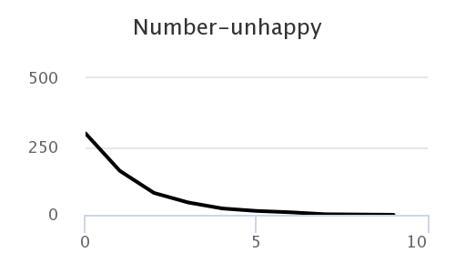
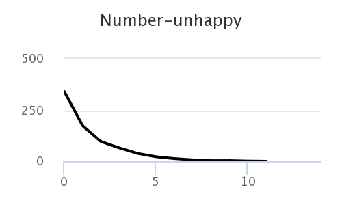
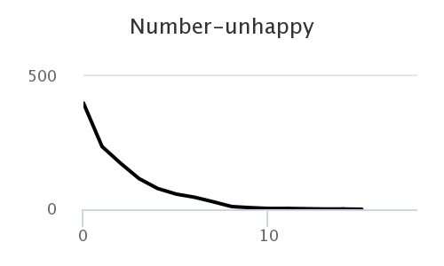
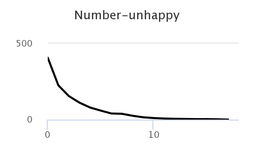
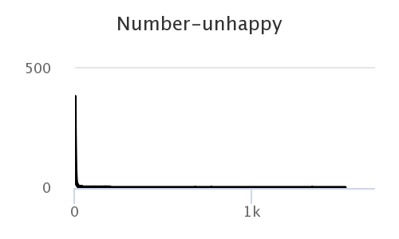

#  Імітаційне моделювання комп'ютерних систем #
#  СПм-21-2, Щепка Олексій Олександрович #
### ІНДЗ №1. Описание имитационных моделей ###

### Выбранная модель в среде NetLogo: ###
[Segregation](http://www.netlogoweb.org/launch#http://www.netlogoweb.org/assets/modelslib/Sample%20Models/Social%20Science/Segregation.nlogo)

### Вербальное описание модели: ###
Этот проект моделирует поведение двух типов агентов по соседству. Оранжевые агенты и синие агенты ладят друг с другом. Но каждый агент хочет убедиться, что рядом живет какой-то «свой». То есть каждый оранжевый агент хочет жить рядом хотя бы с несколькими оранжевыми агентами, а каждый синий агент хочет жить рядом хотя бы с несколькими синими агентами. Моделирование показывает, как эти индивидуальные предпочтения распространяются по соседству, приводя к крупномасштабным закономерностям.

### Управляющие параметры: ###
+ density управляет плотностью размещения соседства (и, следовательно, общим количеством агентов)
+ %-SIMILAR-WANTED управляет процентом агентов одного цвета, которые каждый агент хочет видеть среди своих соседей. Например, если ползунок установлен на 30, каждый синий агент хочет, чтобы по крайней мере 30% его соседей были синими агентами.
+ VISUALIZATION - есть два варианта визуализации агентов. Вариант СТАРЫЙ использует визуализацию, которая использовалась в модели сегрегации в прошлом. Опция SQUARE-X визуализирует агентов в виде квадратов. Недовольные агенты визуализируются как Xs.

### Внутренние параметры: ###
+ happy? для каждой черепахи указывает, есть ли хотя бы %-SIMILAR-WANTED процент соседей этой черепахи того же цвета, что и черепаха
+ percent-similar в среднем, какой процент соседей черепахи имеет тот же цвет, что и эта черепаха?
+ percent-unhappy какой процент черепах недовольны?
+ similar-nearby на скольких соседних участках есть черепаха моего цвета?
+ other-nearby сколько существует черепах другого цвета?
+ total-nearby сумма двух предыдущих переменных

### Критерии эффективности системы: ###
+ % SIMILAR показывает средний процент соседей одного цвета для каждого агента. Он начинается примерно с 50%, поскольку каждый агент начинает (в среднем) с равным количеством оранжевых и синих агентов в качестве соседей.
+ NUM-UNHAPPY показывает количество недовольных агентов.
+ % UNHAPPY показывает процент агентов, у которых меньше соседей одного цвета, чем они хотят (и, следовательно, хотят переместиться).

### Примечания: ###
Когда вы выполняете SETUP, оранжевые и синие агенты случайным образом распределяются по окрестностям. Но многие агенты «недовольны» тем, что им не хватает соседей одного цвета. Несчастные агенты переезжают в новые места поблизости. Но в новых локациях они могут нарушить баланс местного населения, что побудит других агентов уйти. Если несколько агентов переместятся в область, местные синие агенты могут уйти. Но когда синие агенты перемещаются в новую область, они могут побудить оранжевых агентов покинуть эту область.
В случае, когда каждый агент хочет иметь как минимум 30% соседей своего цвета, агенты получают (в среднем) 70% соседей своего цвета. Таким образом, относительно небольшие индивидуальные предпочтения могут привести к значительной общей сегрегации.

### Недостатки модели: ###
В модели учтен только параметр свой-чужой, но не учтен, например, параметр хороший-плохой сосед. Также, как и параметр, что они не всегда знают, является ли кто-то хорошим соседом. Когда они это знают наверняка, то используют эту информацию. Когда это не так, они используют цвет в качестве заменителя, т. е. предполагают, что агенты одного цвета являются хорошими соседями.

# Вычислительные эксперименты #
### 1.Если каждый агент хочет иметь как минимум 40% соседей своего цвета, какой процент (в среднем) они получат? ###
В результате 3 экспериментов были получены значения: 81,7	83,6	83,7. Среднее значение - 83.

<table>
<thead>
<tr><th>Терпимость, %</th><th>Время до достижения стабильного состояния</th></tr>
</thead>
<tbody>
<tr><td>12</td><td>7260</td></tr>
<tr><td>24</td><td>16</td></tr>
<tr><td>36</td><td>5</td></tr>
<tr><td>48</td><td>4</td></tr>
</tbody>
</table>
Как видно из таблицы, чем ближе мы к отметке TOLERANCE=10, тем больше времени требуется для достижения стабильного состояния.

### 2. Как начальная плотность влияет на процент недовольных агентов? ###

### 3. Как начальная ПЛОТНОСТЬ влияет на время, необходимое для остановки модели? ###

   
   

В целом можно отметить, что средние значения времени, необходимого для остановки модели, в диапазоне 50-90 варьируются около 13. В диапазоне 90-97 можно заметить незначительное увеличение среднего времени (где-то к отметке 17) для отработки модели и в диапазоне значений плотности 98-99 модель не остановится. Эксперименты проводились при изначальном значении управляющего параметра %-SIMILAR-WANTED = 30
