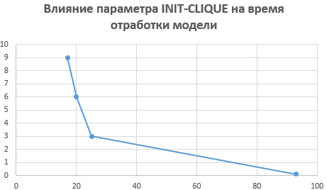
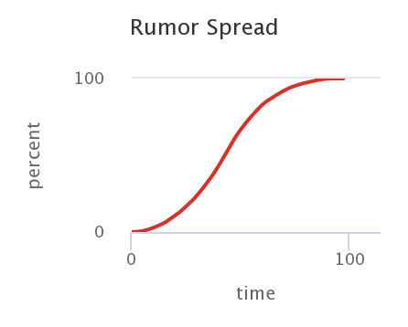
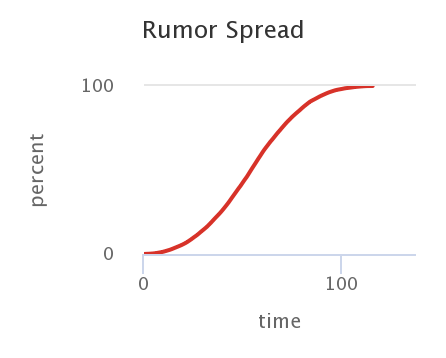

#  Імітаційне моделювання комп'ютерних систем #
#  СПм-21-2, Щепка Олексій Олександрович #
### ІНДЗ №2. Описание имитационных моделей ###

### Выбранная модель в среде NetLogo: ###
[Rumor Mill](http://www.netlogoweb.org/launch#http://www.netlogoweb.org/assets/modelslib/Sample%20Models/Social%20Science/Rumor%20Mill.nlogo)

### Вербальное описание модели: ###
Эта программа моделирует распространение слуха. Слух распространяется, когда человек, который знает слух, рассказывает одному из своих соседей. Другими словами, пространственная близость является определяющим фактором того, как скоро (и, возможно, как часто) данный человек услышит слух.

Соседи могут быть определены либо как четыре соседних человека, либо как восемь соседних людей. На каждом временном шаге каждый человек, которому известен слух, случайным образом выбирает соседа, которому он должен сообщить этот слух. Моделирование отслеживает, кто знает слух, сколько людей знает слух и сколько происходит «повторных рассказов» слуха.

### Управляющие параметры: ###
+ EIGHT-MODE? является переключателем, который определяет, распространяется ли слух на каждом временном шаге к одному из четырех случайно выбранных соседей или к одному из восьми таких соседей.
+ INIT-CLIQUE определяет процент населения, которому изначально известен слух
+ SETUP-ONE - запускает слух в одной точке в центре мира.
+ SETUP-RANDOM - «засевает» слух случайным образом, выбирая процент населения, который изначально знает слух. Этот процент устанавливается с помощью ползунка INIT-CLIQUE.

### Внутренние параметры: ###
+ times-heard отслеживает время, когда слух был услышан. Часы тикают, когда впервые услышали слух. -1 означает, что до патча не дошли слухи.
+ first-heard отслеживает агента, который первым услышал слух

### Критерии эффективности системы: ###
+ CLIQUE% — это процент людей, до которых дошел слух.

### Примечания: ###
Три цветные кнопки справа от вида дают вам топографические карты мира. Кнопка COLOR: WHEN HEARD, окрашивает пятна в разные оттенки ЖЕЛТОГО в зависимости от того, когда это место впервые услышало слух. Кнопка COLOR: TIMES HEARD окрашивает пятна в разные оттенки ЗЕЛЕНОГО цвета в зависимости от того, сколько раз это место слышало слух.

### Недостатки модели: ###
В модели не учтены физические преграды распространению слухов. Эти пространственные преграды были бы препятствиями, вокруг которых должны были бы распространяться слухи. Можно представить себе комнату, где есть только один вход. Сколько времени потребуется, чтобы охватить все население в этом случае?

# Вычислительные эксперименты #
### 1. Как параметр INIT-CLIQUE влияет на % осведомленных людей к моменту 10 тика? ###
В результате 6 экспериментов были получены результаты, для демонстрации которых логично вывести график и таблицу зависимости параметра init-clique и % осведомленных людей: 
<table>
<thead>
<tr><th>INIT-CLIQUE</th><th>% осведомленных</th></tr>
</thead>
<tbody>
<tr><td>0.1</td><td>3,186</td></tr>
<tr><td>2</td><td>72,718</td></tr>
<tr><td>4</td><td>90,423</td></tr>
<tr><td>6</td><td>95,255</td></tr>
<tr><td>8</td><td>99,108</td></tr>
<tr><td>10</td><td>99,167</td></tr>
</tbody>
</table>

Можно заметить, что чем больше параметр INIT-CLIQUE, тем больший процент осведомленных о слухе людей на момент 10 тика.

### 2. Как параметр INIT-CLIQUE влияет на время отработки модели? ###
Параметр INIT-CLIQUE влияет на время отработки модели таким обюразом, что чем больше значение этого параметра (при прочих равных остальных), тем меньше время отработки. Видно это из таблицы ниже:
<table>
<thead>
<tr><th>INIT-CLIQUE</th><th>Время отработки</th></tr>
</thead>
<tbody>
<tr><td>0.1</td><td>93</td></tr>
<tr><td>3</td><td>25</td></tr>
<tr><td>6</td><td>20</td></tr>
<tr><td>9</td><td>17</td></tr>
</tbody>
</table>

### 3. Как параметр EIGHT-MODE? влияет на время, необходимое для остановки модели? ###
Для начала нажмем на кнопку step-one, затем установим с помощью мыши еще 3 точки в левой части области (init-clique = 0.1) и проведем эксперименты с зажатым параметром EIGHT-MODE?

и с отжатым 

В целом можно отметить, что средние значения времени, необходимого для остановки модели, с включенным этим параметром меньше, чем при выключенном.
