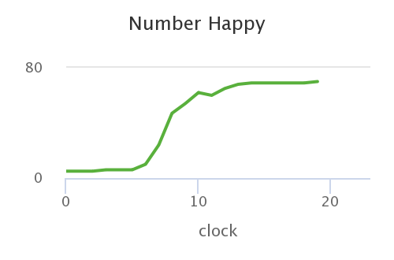
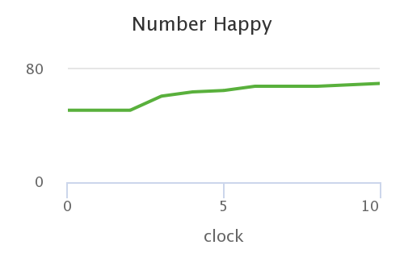
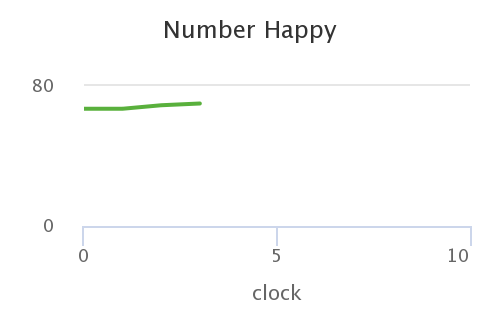

#  Імітаційне моделювання комп'ютерних систем #
#  СПм-21-2, Щепка Олексій Олександрович #
### Лабораторная работа №1. Описание имитационных моделей ###

### Выбранная модель в среде NetLogo: ###
[Party](http://www.netlogoweb.org/launch#http://www.netlogoweb.org/assets/modelslib/Sample%20Models/Social%20Science/Party.nlogo)

### Вербальное описание модели: ###
Модель коктейльной вечеринки. Мужчины и женщины на вечеринке образуют группы. Тусовщик чувствует себя некомфортно и меняет группу, если в ее текущей группе слишком много представителей противоположного пола.

### Управляющие параметры: ###
+ NUMBER управляет количеством людей в группе
+ NUM-GROUPS определяет количество формируемых групп.
+ TOLERANCE определяет их уровень комфорта в группе, в которой есть представители противоположного пола. Если они находятся в группе, в которой процент людей противоположного пола выше, чем позволяет их ТЕРПИМОСТЬ, то они считаются «неудобными» и покидают эту группу, чтобы найти другую группу.

### Внутренние параметры: ###
+ happy? счастлив ли агент от пребывания на вечеринке
+ group-sites агентский набор патчей, где находятся группы
+ boring-groups сколько групп в настоящее время однополые

### Критерии эффективности системы: ###
+ number happy показывает, сколько тусовщиков счастливы (то есть ощущают себя комфортно).
+ single sex groups показывает количество групп, состоящих только из мужчин или только из женщин.

### Примечания: ###
Чтобы продвинуть модель на один шаг, используйте кнопку GO ONCE. Кнопка GO поддерживает работу модели до тех пор, пока всем не агенты не будут чувствовать себя комфортно.

### Недостатки модели: ###
установление максимального количества человек в группе не реализовано в этой модели, чтобы, если в группе было слишком много людей, они становились недовольными.

# Вычислительные эксперименты #
### 1.Возможны ли такие начальные условия, при которых вечеринка никогда не достигнет стабильного состояния? (т. е. модель никогда не останавливается) ###
Да, возможны. Например, если значение управляющего параметра TOLERANCE будет не более 10 (TOLERANCE<=10).

### 2. При разных уровнях толерантности всем требуется больше или меньше времени, чтобы почувствовать себя комфортно? ###

График, наглядно демонстрирующий, что при уровне толерантности в 25% всем потребуется около 20 часов, чтобы почувствовать себя комфортно.

График, наглядно демонстрирующий, что при уровне толерантности в 50% всем потребуется приблизительно в 2 раза меньше времени, чтобы почувствовать себя комфортно, чем в предыдущем случае.

График, наглядно демонстрирующий, что при уровне толерантности в 75% всем потребуется около 3 часов, чтобы почувствовать себя комфортно.
В экспериментах были задействованы разные уровни толерантности, результаты же показали, что чем меньше толерантность , тем больше всем требуется времени, чтобы почувствовать себя комфортно. Работает данная зависимость и в обратную сторону - чем больше толерантность, тем меньше времени нужно всем, чтобы почувствовать себя комфортно на вечеринке.

### 3. Существует ли критическая терпимость, при которой все группы становятся однополыми? ###
Таблица экспериментов, наглядно показывающая, что при тех уровнях терпимости, где мы можем дождаться результата выполнения модели, мы можем получать различные количества однополых групп, а значит никакой критической терпимости , при которой все группы однополые - нет.
<table>
<thead>
<tr><th>Терпимость, %</th><th>Количество однополых групп</th></tr>
</thead>
<tbody>
<tr><td>15</td><td>7</td></tr>
<tr><td>30</td><td>8</td></tr>
<tr><td>45</td><td>9</td></tr>
<tr><td>60</td><td>5</td></tr>
<tr><td>75</td><td>2</td></tr>
<tr><td>90</td><td>1</td></tr>
</tbody>
</table>
При проведении вычислительных экспериментов критической терпимости, при которой все группы становились бы однополыми, не выявлено. 
